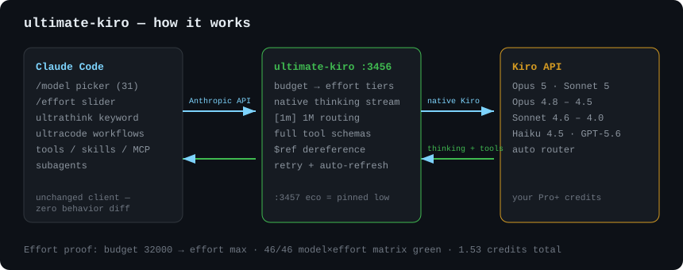
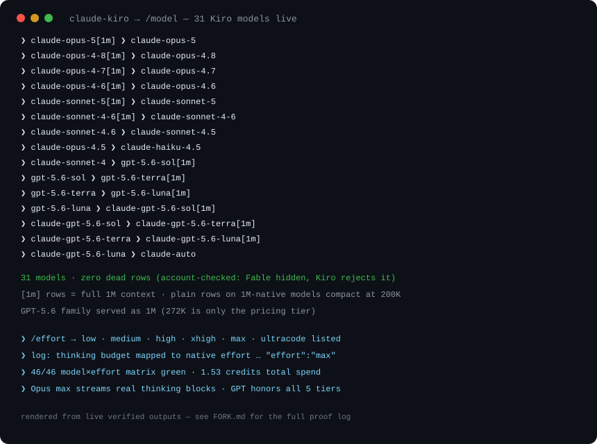
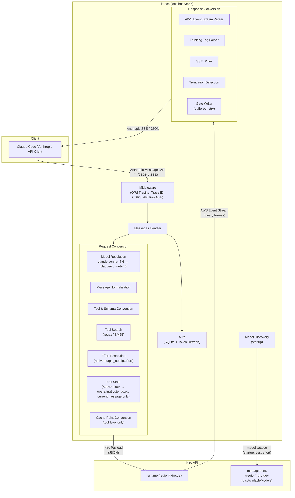

# Claude Code + Kiro Models

[](https://github.com/wealthscribeyt/claude-code-kiro-models/releases)
[](LICENSE)
[](go.mod)
[](https://github.com/wealthscribeyt/claude-code-kiro-models/releases)

Run **Claude Code on Kiro models** — 31 models, native thinking, max effort, 1M context — with subscription-identical behavior (`/model`, `/effort`, `ultrathink`, `ultracode`, skills, MCP, subagents).

A local proxy server that relays Anthropic Messages API-compatible requests to the Kiro backend using Kiro CLI credentials.

Just set `ANTHROPIC_BASE_URL` from any Anthropic API client (e.g., Claude Code) to use Claude models via Kiro.

## 60-second quickstart (Windows)

```powershell
# 1. terminal 1 — start the bridge (keep open)
.\bin\ultimate-kiro.exe -port 3456
# 2. terminal 2 — launch Claude Code on Kiro
$env:ANTHROPIC_BASE_URL="http://127.0.0.1:3456"
$env:ANTHROPIC_AUTH_TOKEN="x"
$env:CLAUDE_CODE_ENABLE_GATEWAY_MODEL_DISCOVERY="1"
claude --model claude-opus-5[1m]   # /model switches mid-session
```

## Ultimate build — Claude Code at max quality





- **Max effort by default**, budget→tier mapping, `KIROCC_FORCE_EFFORT` override
- **Native thinking streams**, `[1m]` 1M routing, full MCP schemas, `$ref` dereferencing
- **Verified live:** 31/31 models route, 46/46 model×effort matrix green, GPT honors all 5 tiers
- See [FORK.md](FORK.md) for build notes and the full proof log

## Features

- **Anthropic Messages API compatible** — Supports `/v1/messages` (streaming / non-streaming), `/v1/messages/count_tokens`, and `/v1/models`
- **Request conversion** — Automatically converts Anthropic API requests to Kiro API (AWS Event Stream) format
- **Response conversion** — Converts Kiro event streams back to Anthropic SSE format
- **Automatic auth management** — Reads credentials from Kiro CLI's SQLite DB with automatic token refresh (Social / OIDC)
- **Kiro API key authentication** — Alternatively authenticate with a `KIRO_API_KEY` (`ksk_…`) for headless environments (CI, containers) where an interactive Kiro login is not available
- **Model mapping** — Maps Anthropic model names (e.g., `claude-sonnet-4-6`) to Kiro model names. Customizable via environment variable
- **Automatic model discovery** — Fetches Kiro's model catalog (`ListAvailableModels`) at startup, so models Kiro launches after a kirocc release resolve with the right context window and effort levels without a code change. Built-in mappings always win; discovery only fills gaps
- **Custom API region** — Pin the region in `runtime.<region>.kiro.dev` with `-kiro-api-region`, for accounts whose stored credential region is not one Kiro serves
- **Extended Thinking** — Enable via the `[1m]` suffix, the `thinking` field, or `output_config.effort`. Reasoning depth travels natively as `additionalModelRequestFields.output_config.effort` (validated against each model's enum; defaults to `medium` for effort-capable models when thinking is on without an explicit effort)
- **Tool Search** — Proxy-side implementation of Anthropic's [Tool Search Tool](https://platform.claude.com/docs/en/agents-and-tools/tool-use/tool-search-tool). Supports `tool_search_tool_regex_20251119` and `tool_search_tool_bm25_20251119` with `defer_loading` for on-demand tool discovery
- **Prompt Caching** — Converts Anthropic tool-level `cache_control` to Kiro `cachePoint`
- **Truncation detection** — Automatically injects a notice into the next request when a response is truncated
- **Retry** — Exponential backoff retry for 403 (token expiry), 429, and 5xx errors. Also retries thinking-only (empty visible) responses
- **API key auth** — Optional access restriction for the proxy itself
- **CORS** — Allows requests from localhost origins
- **File logging** — Write structured logs (OTel JSON Lines) to a rotating file via [lumberjack](https://github.com/natefinch/lumberjack). Defaults optimized for coding agent consumption (10 MB, uncompressed)
- **OpenTelemetry tracing** — Opt-in distributed tracing via `--otel` with OTLP HTTP exporter. Captures request/response headers and body as span events across the full proxy chain

## Prerequisites

- Go 1.27+
- One of the following:
  - [Kiro CLI](https://kiro.dev) installed and logged in, **or**
  - A Kiro API key (`KIRO_API_KEY`) — available for [Kiro Pro, Pro+, Pro Max, and Power](https://kiro.dev/docs/cli/authentication/) subscribers

## Installation

### Homebrew

```bash
brew install d-kuro/tap/kirocc
```

### go install

```bash
go install github.com/d-kuro/kirocc/cmd/kirocc@latest
```

## Usage

### Start the server

```bash
kirocc
```

Listens on `http://127.0.0.1:3456` by default.

### Use with Claude Code

```bash
export ANTHROPIC_BASE_URL=http://127.0.0.1:3456
export ANTHROPIC_AUTH_TOKEN=dummy
export CLAUDE_CODE_ENABLE_GATEWAY_MODEL_DISCOVERY=1   # optional: adds kirocc's models to the /model picker
claude
```

`ANTHROPIC_AUTH_TOKEN` is required by Claude Code but not used for authentication by kirocc (credentials are read from Kiro CLI's DB). Any non-empty value works unless `-api-key` is set.

`CLAUDE_CODE_ENABLE_GATEWAY_MODEL_DISCOVERY=1` makes Claude Code fetch `GET /v1/models` from kirocc and list the results in the `/model` picker under "From gateway" — including the "(1M context)" entries (see [1M context with Claude Code](#1m-context-with-claude-code)) and the GPT 5.6 models via their `claude-gpt-5.6-*` aliases (see [Model picker integration](#model-picker-integration-discovery-aliases)).

> [!IMPORTANT]
> For the 1M context window you must pick a "(1M context)" entry in `/model` — see [1M context with Claude Code](#1m-context-with-claude-code).

### Use with a Kiro API key

For headless environments (CI, containers, remote machines) where an interactive Kiro login is not available, you can authenticate with a [Kiro API key](https://kiro.dev/docs/cli/authentication/) instead:

```bash
export KIRO_API_KEY=ksk_...          # your Kiro API key
kirocc                               # no Kiro CLI login or database needed
```

When `KIRO_API_KEY` is set:

- The SQLite credential database is **never opened** — kirocc does not need Kiro CLI installed
- No token refresh occurs — the key is presented directly to the Kiro API
- A revoked key surfaces as a 401 from the API at request time
- An empty or unset key falls back to the credential database as before

Optionally set `KIRO_API_REGION` (default: `us-east-1`) if your Kiro account is in a different region.

Then use with Claude Code as usual:

```bash
export ANTHROPIC_BASE_URL=http://127.0.0.1:3456
export ANTHROPIC_AUTH_TOKEN=dummy
claude
```

API keys are available for Kiro Pro, Pro+, Pro Max, and Power subscribers. On group subscriptions, an administrator must enable key generation in _Settings → Kiro settings → Enable users to generate API keys_. Create keys at [app.kiro.dev](https://app.kiro.dev) → API Keys.

### Command-line options

| Flag                  | Default                   | Description                                                         |
| --------------------- | ------------------------- | ------------------------------------------------------------------- |
| `-port`               | `3456`                    | Listen port                                                         |
| `-host`               | `127.0.0.1`               | Bind host                                                           |
| `-db`                 | (OS-dependent, see below) | Kiro CLI SQLite DB path                                             |
| `-api-key`            | (none)                    | API key required to access the proxy                                |
| `-kiro-api-key`       | (none)                    | Kiro API key (`ksk_…`) to use instead of the Kiro CLI DB credential |
| `-kiro-api-region`    | (credential's region)     | Region for Kiro API endpoints (`runtime.<region>.kiro.dev`)         |
| `-model-discovery`    | `true`                    | Fetch Kiro's model catalog at startup                               |
| `-keepalive-interval` | `15s`                     | SSE idle keep-alive interval (0 = disabled)                         |
| `-debug`              | `false`                   | Enable debug logging                                                |
| `-log-file`           | (none)                    | Write logs to file with rotation (file-only by default)             |
| `-log-max-size`       | `10`                      | Max log file size in MB before rotation                             |
| `-log-max-backups`    | `5`                       | Max number of old log files to retain                               |
| `-log-max-age`        | `7`                       | Max days to retain old log files                                    |
| `-log-compress`       | `false`                   | Compress rotated log files with gzip                                |
| `-log-console`        | `false`                   | Also write logs to console when `-log-file` is set                  |
| `-otel`               | `false`                   | Enable OpenTelemetry tracing (OTLP HTTP exporter)                   |
| `-otel-body-limit`    | `32768`                   | Max bytes of request body to capture in OTel spans (0 = unlimited)  |

#### Default DB path

| OS      | Path                                                  |
| ------- | ----------------------------------------------------- |
| macOS   | `~/Library/Application Support/kiro-cli/data.sqlite3` |
| Linux   | `~/.local/share/kiro-cli/data.sqlite3`                |
| Windows | `%LOCALAPPDATA%\kiro-cli\data.sqlite3`                |

### Environment variables

Command-line options can be overridden with environment variables.

| Variable                    | Corresponding option  |
| --------------------------- | --------------------- |
| `KIROCC_PORT`               | `-port`               |
| `KIROCC_HOST`               | `-host`               |
| `KIROCC_DB_PATH`            | `-db`                 |
| `KIROCC_API_KEY`            | `-api-key`            |
| `KIRO_API_KEY`              | `-kiro-api-key`       |
| `KIRO_API_REGION`           | `-kiro-api-region`    |
| `KIROCC_MODEL_DISCOVERY`    | `-model-discovery`    |
| `KIROCC_KEEPALIVE_INTERVAL` | `-keepalive-interval` |
| `KIROCC_DEBUG`              | `-debug`              |
| `KIROCC_LOG_FILE`           | `-log-file`           |
| `KIROCC_LOG_MAX_SIZE`       | `-log-max-size`       |
| `KIROCC_LOG_MAX_BACKUPS`    | `-log-max-backups`    |
| `KIROCC_LOG_MAX_AGE`        | `-log-max-age`        |
| `KIROCC_LOG_COMPRESS`       | `-log-compress`       |
| `KIROCC_LOG_CONSOLE`        | `-log-console`        |
| `KIROCC_OTEL`               | `-otel`               |
| `KIROCC_OTEL_BODY_LIMIT`    | `-otel-body-limit`    |

`KIRO_API_KEY` and `KIRO_API_REGION` intentionally keep Kiro's own names rather than the `KIROCC_` prefix, so a machine already configured for headless kiro-cli needs no kirocc-specific setup.

### Custom API region

Kiro API endpoints are region-scoped: completions go to `runtime.<region>.kiro.dev` and the model catalog to `management.<region>.kiro.dev`. By default the region comes from the Kiro CLI credential (the profile ARN, or the region stored by kiro-cli).

That default is not always a region Kiro serves. kiro-cli records the region you signed in from, and only a few regions have Kiro hosts — `us-east-1`, `eu-central-1`, `us-gov-east-1`, `us-gov-west-1` at the time of writing. If your credential resolves to anything else, the hostname does not exist and every request fails with an upstream error. `-kiro-api-region` pins the region instead:

```bash
kirocc -kiro-api-region us-east-1
```

```
INFO Kiro API region pinned region=us-east-1
INFO credentials loaded auth_type=idc region=ap-southeast-1
```

The override applies to the API endpoints only. Token refresh still targets the region that issued the credential, since a token is rejected outside it.

### Automatic model discovery

At startup kirocc calls Kiro's `ListAvailableModels` and installs the result as a fallback layer behind the built-in mapping table. A model Kiro launches after a kirocc release therefore resolves with its real context window and effort enum instead of falling back to pass-through defaults, and shows up in `GET /v1/models`.

Resolution order is `KIROCC_MODEL_MAPPINGS` → built-in table → discovered catalog, first match wins. Built-ins deliberately win: they encode behaviour a mechanically derived entry cannot reproduce, such as which `[1m]` aliases must _not_ enable extended thinking and which SKU a 1M request routes to.

Discovery is best-effort and never blocks startup or fails a request. It is skipped when the credential has no profile ARN (which is the case for `-kiro-api-key` auth, since the API requires one), and any error leaves the built-in table in place:

```
WRN model discovery failed, using built-in model table region=ap-southeast-1 err="..."
```

Disable it with `-model-discovery=false`.

### OpenTelemetry tracing

Enable distributed tracing to visualize the full request chain in Jaeger, Grafana Tempo, or any OTLP-compatible backend.

```bash
# Start a local collector (e.g., Grafana LGTM stack)
docker run -d --name lgtm -p 3000:3000 -p 4317:4317 -p 4318:4318 grafana/otel-lgtm

# Start kirocc with tracing enabled
kirocc -otel
```

The OTLP endpoint defaults to `http://localhost:4318` and can be configured via the standard `OTEL_EXPORTER_OTLP_ENDPOINT` environment variable.

### Custom model mappings

Use the `KIROCC_MODEL_MAPPINGS` environment variable to override model name mappings.

```bash
export KIROCC_MODEL_MAPPINGS='[{"anthropic":"my-model","kiro":"claude-sonnet-4.5","context_window_size":200000}]'
```

Optional fields: `kiro_1m` (the SKU a 1M request routes to; set it equal to `kiro` for an always-1M model) and `display_name` (adds the entry to `/v1/models`, so Claude Code's picker lists it — plus a `(1M context)` variant when `kiro_1m` is a separate SKU). An `anthropic` ID may carry the `[1m]` suffix in either case; it is canonicalized to `[1m]`. Because overrides win the lookup, an override that shadows a built-in ID also replaces its `[1m]` entry — the list only advertises a 1M ID when the override can actually deliver it.

## Endpoints

| Path                             | Description                              |
| -------------------------------- | ---------------------------------------- |
| `GET /health`                    | Health check                             |
| `GET /v1/models`                 | List available models                    |
| `POST /v1/messages`              | Messages API (streaming / non-streaming) |
| `POST /v1/messages/count_tokens` | Token count (approximate \*)             |

\* `count_tokens` uses the `cl100k_base` encoding from [tiktoken-go](https://github.com/pkoukk/tiktoken-go), which differs from Claude's actual tokenizer. The returned value is an approximation.

## Architecture



### Request flow

1. Client sends an Anthropic Messages API request to kirocc
2. Middleware assigns a trace ID, handles CORS, and validates the API key
3. Auth reads/refreshes credentials from Kiro CLI's SQLite DB
4. Handler resolves the model name and determines thinking mode
5. Request conversion pipeline:
   - Normalizes messages (merges consecutive same-role messages, extracts text/images/tool_use/tool_result from multi-block content)
   - Converts tools and sanitizes JSON Schema (removes unsupported keywords, flattens `anyOf`/`oneOf`/`allOf`)
   - If tool search tools are present, partitions tools into active/deferred and injects a proxy-side `ToolSearch` tool
   - Extracts system prompt and places it as a history entry pair
   - Parses the `<env>` block from the system prompt into `envState` (`operatingSystem`, `currentWorkingDirectory`) and attaches it to the current message only
   - Reorders tool results to match the preceding assistant's tool_use order
   - Forwards reasoning effort natively as `additionalModelRequestFields.output_config.effort` at the request root (sibling of `conversationState`); the resolved effort is validated/clamped per model
   - Converts Anthropic tool-level `cache_control` to Kiro `cachePoint`
6. Kiro API returns an AWS Event Stream (binary frames)
7. Response conversion pipeline:
   - Parses binary event stream frames
   - Forwards incremental text frames from the backend as SSE deltas
   - Intercepts `ToolSearch` tool_use calls, executes search, emits `server_tool_use`/`tool_search_tool_result` SSE events, and re-requests Kiro with discovered tools (up to 3 rounds)
   - Parses `<thinking>` tags from `assistantResponseEvent` or uses `reasoningContentEvent` (with deduplication)
   - Enforces `stop_sequences` and `max_tokens` adapter-side
   - Detects truncated responses and stores them; a notice is injected into the next request
   - Gate Writer buffers output until visible content arrives, enabling transparent retry of thinking-only responses

### Extended Thinking

kiro-cli 2.10.0 expresses reasoning depth natively through `output_config.effort`. kirocc forwards it as `additionalModelRequestFields.output_config.effort` at the request root (sibling of `conversationState`):

```json
{
  "conversationState": { "...": "..." },
  "additionalModelRequestFields": {
    "output_config": { "effort": "medium" }
  }
}
```

Thinking is enabled by either of:

- Model name with `[1m]` suffix (e.g., `claude-sonnet-4-6[1m]`)
- `thinking.type` set to `"enabled"` or `"adaptive"` in the request

An `Anthropic-Beta` header containing `context-1m` (e.g., `context-1m-2025-08-07`) is a pure context-window signal, matching Anthropic's long-context beta semantics: it routes the request to the model's 1M SKU but does **not** enable thinking. Claude Code sends this header automatically whenever the session model carries `[1m]`, so coupling it to thinking would force thinking on for every 1M session.

Exception: the `[1m]` suffix on an **always-1M** model (`claude-opus-5[1m]` / `claude-opus-4-8[1m]` / `claude-opus-4-7[1m]` / `claude-opus-4-6[1m]` / `claude-sonnet-5[1m]` / `claude-fable-5-1[1m]`) is a first-class alias that only advertises the 1M context window — it does **not** enable thinking either (see [Model mappings](#model-mappings)). Thinking on those models is opt-in via the `thinking` field.

The suffix is matched case-insensitively because Claude Code may emit `[1M]`
from internal call paths. Responses always use the canonical lowercase `[1m]`.

The reasoning effort sent to the backend is resolved as follows:

1. An explicit, recognized `output_config.effort` wins, validated/clamped to the model's allowed enum (`xhigh` on a 4-value model clamps to `max`; unrecognized strings are dropped).
2. Otherwise, if reasoning is enabled (via `thinking.type` or the `[1m]` suffix) without an explicit effort, a default effort of `medium` is sent so the intent reaches the backend.
3. Otherwise the field is omitted.

Per-model allowed effort levels:

- `claude-opus-5`, `claude-opus-4.8`, `claude-opus-4.7`, `claude-sonnet-5`, `claude-fable-5.1`: `low`, `medium`, `high`, `xhigh`, `max`
- `claude-opus-4.6`, `claude-sonnet-4.6` (and their `-1m` variants): `low`, `medium`, `high`, `max` (no `xhigh`; clamps to `max`)
- Models not listed here fall back to the enum advertised by [model discovery](#automatic-model-discovery), if any
- All other models omit `additionalModelRequestFields` entirely

`thinking.budget_tokens` is accepted in the request but no longer affects behavior; reasoning depth is conveyed entirely through `effort`.

#### GPT 5.6 models (reasoning schema)

The GPT 5.6 family (`gpt-5.6-sol`, `gpt-5.6-terra`, `gpt-5.6-luna`) uses a different `additionalModelRequestFields` schema — `reasoning.effort` instead of `output_config.effort`:

```json
{
  "conversationState": { "...": "..." },
  "additionalModelRequestFields": {
    "reasoning": { "effort": "high" }
  }
}
```

GPT-specific effort rules:

- No `thinking` field and no explicit effort → the field is omitted entirely (the backend defaults to `high`, matching kiro-cli behavior)
- `thinking.type: "enabled"` / `"adaptive"` → still omitted (= backend default `high`); no downgrade to `medium`
- `thinking.type: "disabled"` → `reasoning.effort: "none"` (takes precedence over an explicit effort)
- Explicit `output_config.effort` → validated against the GPT enum (`none`, `low`, `medium`, `high`, `xhigh`, `max`) and forwarded as `reasoning.effort`

GPT reasoning streams as opaque `redacted_thinking` blocks (base64 blobs, no visible thinking text). The blob arrives **after** text/tool_use in the upstream stream and is surfaced to the client in that order. During tool-use continuations the client must send the `redacted_thinking` block back; kirocc replays it as `reasoningContent.redactedContent` in the request history only while that tool round is in flight.

The `[1m]` suffix and `context-1m` header are not supported for GPT models (`gpt-5.6-sol[1m]` does not resolve). Context window is 272k input / 128k output; limits are enforced by the backend, not the proxy.

#### Model picker integration (discovery aliases)

Claude Code's [gateway model discovery](https://code.claude.com/docs/en/llm-gateway-protocol) fetches `GET /v1/models` and adds the results to the `/model` picker — but it silently drops any ID that doesn't start with `claude` or `anthropic`, so the bare `gpt-5.6-*` IDs never appear. kirocc therefore also advertises `claude-` prefixed discovery aliases:

| Alias                  | Kiro model      | Picker label    |
| ---------------------- | --------------- | --------------- |
| `claude-gpt-5.6-sol`   | `gpt-5.6-sol`   | `GPT 5.6 Sol`   |
| `claude-gpt-5.6-terra` | `gpt-5.6-terra` | `GPT 5.6 Terra` |
| `claude-gpt-5.6-luna`  | `gpt-5.6-luna`  | `GPT 5.6 Luna`  |

The aliases resolve identically to the canonical IDs (same 272k window, same reasoning schema). To surface them in the picker, launch Claude Code with:

```bash
export ANTHROPIC_BASE_URL=http://127.0.0.1:3456
export ANTHROPIC_AUTH_TOKEN=dummy
export CLAUDE_CODE_ENABLE_GATEWAY_MODEL_DISCOVERY=1
claude
```

The picker shows them under "From gateway" using the `display_name` values above. The canonical `gpt-5.6-*` IDs still work everywhere else (`--model gpt-5.6-sol`, `ANTHROPIC_MODEL`, direct API calls).

### Tool Search

The Kiro backend does not support Anthropic's [Tool Search Tool](https://platform.claude.com/docs/en/agents-and-tools/tool-use/tool-search-tool). kirocc implements it proxy-side with an inner loop:

1. Client sends `tool_search_tool_regex_20251119` (or `bm25`) + tools with `defer_loading: true`
2. Proxy partitions tools into active (sent to Kiro) and deferred (held for search)
3. Proxy injects a `ToolSearch` tool definition that Kiro can understand
4. When the model calls `ToolSearch`, the proxy intercepts the tool_use:
   - Executes regex or BM25 search against deferred tools
   - Emits `server_tool_use` + `tool_search_tool_result` SSE events to the client
   - Promotes discovered tools to active and rebuilds the Kiro request
   - Calls Kiro again with the updated tool list (up to 3 rounds)
5. When the model calls a regular tool or produces text, the response is forwarded to the client

Supported query forms:

- `select:Read,Edit,Grep` — exact tool selection by name
- `read file` — keyword search (regex with word-level OR fallback, or BM25 scoring)

### Model mappings

| Input model             | Kiro model             | Context window |
| ----------------------- | ---------------------- | -------------- |
| `claude-opus-5`         | `claude-opus-5`        | 1M             |
| `claude-opus-5[1m]`     | `claude-opus-5`        | 1M             |
| `claude-sonnet-5`       | `claude-sonnet-5`      | 1M             |
| `claude-sonnet-5[1m]`   | `claude-sonnet-5`      | 1M             |
| `claude-fable-5-1`      | `claude-fable-5.1`     | 1M             |
| `claude-fable-5-1[1m]`  | `claude-fable-5.1`     | 1M             |
| `claude-sonnet-4-6`     | `claude-sonnet-4.6`    | 200k           |
| `claude-sonnet-4-6[1m]` | `claude-sonnet-4.6-1m` | 1M             |
| `claude-sonnet-4.5`     | `claude-sonnet-4.5`    | 200k           |
| `claude-sonnet-4.5[1m]` | `claude-sonnet-4.5-1m` | 1M             |
| `claude-opus-4-8`       | `claude-opus-4.8`      | 1M             |
| `claude-opus-4-8[1m]`   | `claude-opus-4.8`      | 1M             |
| `claude-opus-4-7`       | `claude-opus-4.7`      | 1M             |
| `claude-opus-4-7[1m]`   | `claude-opus-4.7`      | 1M             |
| `claude-opus-4-6`       | `claude-opus-4.6`      | 1M             |
| `claude-opus-4-6[1m]`   | `claude-opus-4.6`      | 1M             |
| `claude-opus-4.5`       | `claude-opus-4.5`      | 200k           |
| `claude-haiku-4.5`      | `claude-haiku-4.5`     | 200k           |
| `gpt-5.6-sol`           | `gpt-5.6-sol`          | 272k           |
| `gpt-5.6-terra`         | `gpt-5.6-terra`        | 272k           |
| `gpt-5.6-luna`          | `gpt-5.6-luna`         | 272k           |
| `claude-gpt-5.6-sol`    | `gpt-5.6-sol`          | 272k           |
| `claude-gpt-5.6-terra`  | `gpt-5.6-terra`        | 272k           |
| `claude-gpt-5.6-luna`   | `gpt-5.6-luna`         | 272k           |

Opus 5, Opus 4.6, 4.7, 4.8, Sonnet 5, and Fable 5.1 always use 1M context (no 200k SKU exists upstream). Unlike Sonnet 4.6, `claude-opus-5`, `claude-sonnet-5`, and `claude-fable-5.1` have no separate `-1m` SKU: each single SKU is always 1M. The explicit `[1m]`-suffixed aliases (`claude-opus-5[1m]` / `claude-opus-4-8[1m]` / `claude-opus-4-7[1m]` / `claude-opus-4-6[1m]` / `claude-sonnet-5[1m]` / `claude-fable-5-1[1m]`) are first-class entries that preserve the suffix verbatim in the response `model` field and do **not** enable extended thinking. On these always-1M models, thinking is opt-in via the `thinking` field; the `[1m]` suffix remains a thinking opt-in for models without a first-class always-1M alias.

Unmatched `claude-*` models are passed through as-is. Non-claude models fall back to `claude-sonnet-4.6` (the `gpt-5.6-*` IDs and their `claude-gpt-5.6-*` discovery aliases above are explicit entries and do not fall back).

#### 1M context with Claude Code

Claude Code (verified against 2.1.232) decides the context window **client-side, from the session model string**: a model whose ID matches `/\[1m\]/i` gets the 1M window; everything else served through a custom `ANTHROPIC_BASE_URL` gets 200k and auto-compacts at ~160k — even when upstream actually has 1M of context. Neither the response `model` field nor anything else kirocc returns can influence this.

To get the 1M window, the **session model itself** must carry the suffix:

- With `CLAUDE_CODE_ENABLE_GATEWAY_MODEL_DISCOVERY=1`, pick a "(1M context)" entry in the `/model` picker — kirocc advertises `claude-opus-5[1m]` ("Opus 5 (1M context)"), `claude-sonnet-4-6[1m]` ("Sonnet 4.6 (1M context)"), etc. in `GET /v1/models` for exactly this purpose. Discovery results are cached in `~/.claude/cache/gateway-models.json`, so restart Claude Code after upgrading kirocc.
- Or set the model explicitly: `claude --model 'claude-opus-5[1m]'`, `ANTHROPIC_MODEL=claude-opus-5[1m]`, or `"model"` in settings.json.

A `[1m]` session model also makes Claude Code send `Anthropic-Beta: context-1m-2025-08-07` on every request; kirocc treats that header as a context-window signal only (it never enables thinking — see [Extended Thinking](#extended-thinking)).

#### Response model ID

The `model` field in `/v1/messages` responses (streaming `message_start`, non-streaming body, and tool-search path) is returned as the **Anthropic-form ID** (e.g. `claude-opus-4-7`), not the Kiro SKU (`claude-opus-4.7`).

When the proxy routes to a **1M context window** (always-1M SKU such as `claude-opus-5` / `claude-opus-4.8` / `claude-opus-4.7` / `claude-opus-4.6`, or a model invoked with the `[1m]` suffix or `Anthropic-Beta: context-1m` header), a trailing `[1m]` is appended to the response model ID (e.g. `claude-opus-5[1m]`). This is informational: it reflects the routed window in Claude Code's per-model usage stats, but Claude Code's context-window logic itself only reads the session model string (see [1M context with Claude Code](#1m-context-with-claude-code)).

Note: `[1m]` has different meanings on request vs. response. On the **request** `model` it is a client-supplied signal (stripped before upstream routing). On the **response** `model` it is purely a routed-window annotation and does not imply that extended thinking was enabled.

## License

Apache License 2.0
